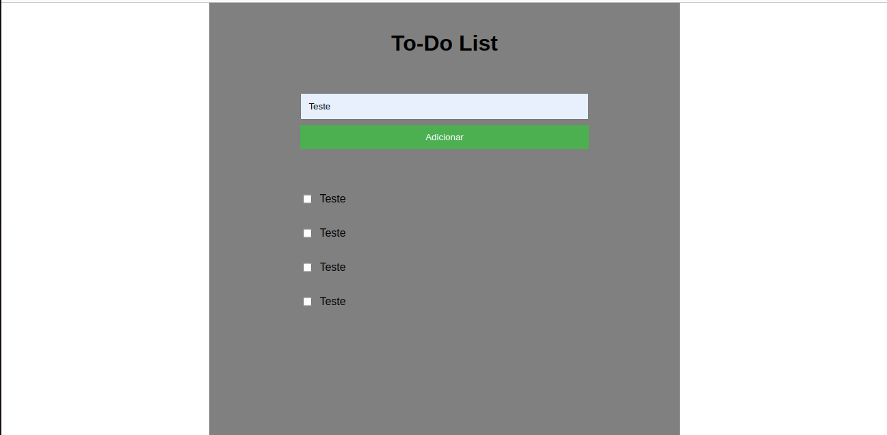

# ToDo List
Este projeto é resultado da aplicação prática das habilidades obtidas durante o meu curso introdutório de desenvolvimento web. Desenvolvido como um "To-Do List", ele representa não apenas a minha jornada de aprendizado, mas também a aplicação efetiva dos conceitos adquiridos.

### **Live Preview** do projeto 
* [ToDo List](https://bruno-guilherme.github.io/todo-list/)

## Habilidades
* HTML5
* CSS3
* JavaScript
* Aprimoramento Pessoal: Desenvolver habilidades práticas, incluindo a resolução de problemas específicos de uma lista de tarefas e a otimização do design da interface.

### Outros projetos
* [Próximo](url)
